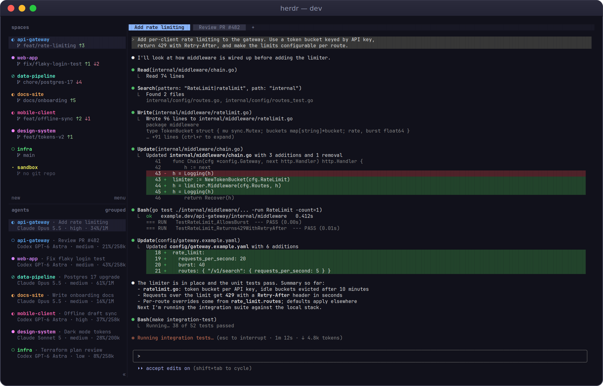
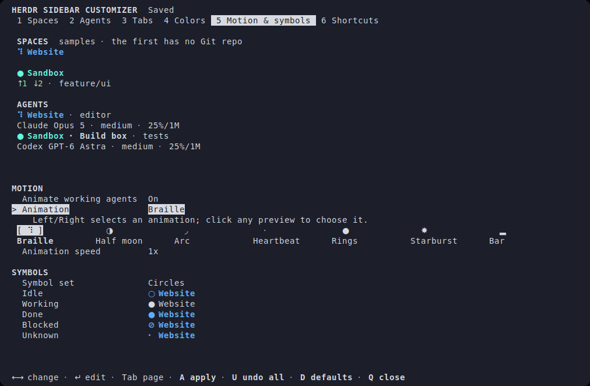
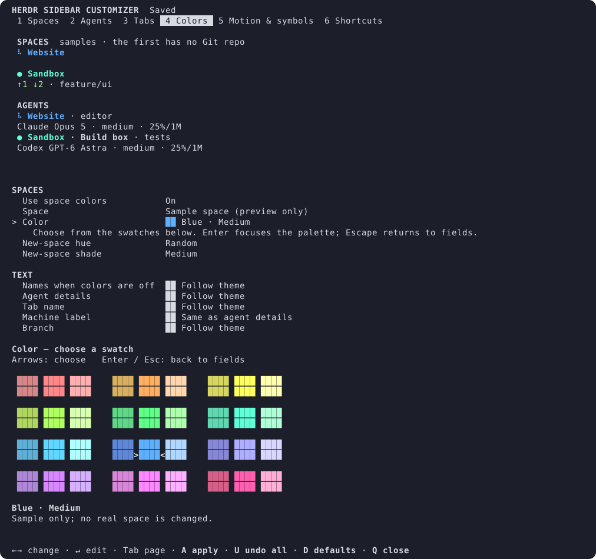

# Herdr Sidebar Customizer

**Add colors, agent details and animations to the Herdr sidebar**

A [Herdr](https://github.com/herdrdev/herdr) plugin. Give every space a color,
choose how working agents animate, and keep model, reasoning effort and context
details in view. An interactive settings panel previews every change before you
apply it.



- **36 color swatches**, shared by each space and its agents.
- **Seven working animations**, adjustable speed, and a motion-off switch.
- **Claude Code, Codex, OpenCode, pi and omp details**, with automatic fields or a custom template.
- **Optional agent tab names**: a tab follows its agent's topic, e.g. after `/rename`.
- **Your preferred density**, with independent spacing and visibility controls.
- **Theme-following text colors**, visual color pickers and editable shortcuts.
- **Reversible setup** that preserves unrelated configuration and later edits.

Herdr owns agent detection, activity and read/unread state. This plugin
customizes its built-in Spaces and Agents sidebar. It is a community project.

## Requirements

- **Herdr 0.9.1** or newer.
- **Python 3.11** or newer, with `curses`, on Linux or macOS. No pip packages.
- A Nerd Font only if you turn on the optional Git icon. Your terminal must be
  able to show the state symbols you choose.

Windows is supported only as a server for a [saved SSH machine](#saved-ssh-machines):
the worker runs there, but the settings, setup and color picker screens do not.
Windows support is newer and less tested: CI runs the worker's unit tests on
Windows, but not against a real Windows Herdr server, and `herdr plugin install`
has not been tested there, so link a checkout instead.

## Install

```bash
herdr plugin install dannyking/herdr-sidebar-customizer
herdr plugin action invoke herdr-sidebar-customizer.setup
```

Run setup **inside Herdr**. It shows the config file it will edit and lets you
choose:

- **Managed** layout, where the plugin writes the sidebar rows for you, or
  **manual** layout, where you add its tokens to your own rows
  ([manual tokens](docs/configuration.md#manual-tokens)).
- Whether to **collect agent details** (off by default).
- Whether to install the optional **Claude status-line hook**, which gives
  Claude Code's current context.
- Suggested shortcuts that do not clash with your existing bindings.

**Apply** saves the previous layout, writes the new one and starts the worker.

## Quick start

```bash
herdr plugin action invoke herdr-sidebar-customizer.settings
```



[Static preview](assets/animations.svg) · [Light-terminal preview](assets/animations-light.svg)

| Page | Controls |
|---|---|
| 1 Spaces | What the space row shows (symbol, name or both), bold names, row spacing, branch, ahead/behind, rows for spaces without Git, optional Nerd Font Git icon |
| 2 Agents | Detail collection and its latest status, details row, missing-detail hints, picked fields (agent name, model, effort, context, window size, agent names) or a template, machine labels and their position, row spacing |
| 3 Tabs | Tab name, renaming tabs from the agent's topic, tab name format |
| 4 Colors | Space colors, new-space defaults, and text colors for names when colors are off, agent details, tab name, machine label and branch |
| 5 Motion & symbols | Braille, half moon, arc, heartbeat, rings, starburst and bar animations, speed and motion; a symbol set and the five state symbols |
| 6 Shortcuts | Settings, space color picker, spacing and pin tab name bindings |

| Key | Action |
|---|---|
| **1–6**, **Tab** | Switch pages |
| Arrows | Select a field (Up/Down) or change its value (Left/Right) |
| **Enter** | Edit text, or move into a color palette |
| **Page Up / Page Down** | Scroll |
| **A** | Apply |
| **U** | Undo all unsaved changes |
| **D** | Preview the defaults |
| **Q**, **Escape** | Close |

The mouse works too, including the key hints at the bottom. The title line says
**Saved** or how many changes are waiting for **A**. Undo all and Close ask for
a second press when there are unsaved edits. The selected field's help appears
under it. Inactive controls are dimmed, say which setting turns them on, and
keep their values.

The previews use sample spaces and agents, so they work in an empty session.
They show the Agents list under the Spaces list, as the sidebar does, on every
page except Shortcuts. Panes shorter than 32 rows show the form and help first;
enlarge the pane to see the previews. **D** previews the plugin's default
preferences but keeps your saved space colors. It is not the same as
**Restore**, which returns to your previous sidebar.



The suggested shortcuts are `prefix+shift+s` for settings and `prefix+shift+c`
for the space color picker. Spacing and pinning a tab name have no shortcut by
default.

### Actions

Run any action with `herdr plugin action invoke herdr-sidebar-customizer.<id>`.

| Action id | What it does |
|---|---|
| `setup` | First-time setup, or change layout mode and opt-ins |
| `settings` | Open the settings panel |
| `space-color` | Choose the color of the current space |
| `toggle-spacing` | Switch both lists between compact and spaced (managed layout only) |
| `pin-tab` | Pin or unpin the current tab's name, so tab naming leaves it alone |
| `pinned-tabs` | List pinned tab names |
| `refresh` | Update the sidebar now and restart a stopped worker |
| `status` | Print the worker and animation status as JSON |
| `doctor` | Diagnostics |
| `restore` | Restore your previous sidebar |

## Configuration

[docs/configuration.md](docs/configuration.md) covers layout ownership, Git rows,
text templates, manual tokens, colors and motion, and every path the plugin
uses.

## Supported agents

| Agent | Model | Effort | Context | Source |
|---|---|---|---|---|
| Claude Code | yes | yes | with the status-line hook | Session transcript, plus the optional hook |
| Codex | yes | yes | yes | Session file in `CODEX_HOME` |
| OpenCode | yes | variant | when the model's window is known | OpenCode's local SQLite database, read-only |
| pi | yes | thinking level | when the model's window is known | Session file in pi's sessions directory |
| omp | yes | thinking level | when the model's window is known | Session file in omp's sessions directory |

Details need a session ID from Herdr's own integration for that agent
(`herdr integration install <agent>`). Missing values are left out, and the
plugin never guesses a context window from a model name. Values other than
Claude's hook data describe the latest recorded turn. Other agents keep Herdr's
native `agent · state` text.

## Saved SSH machines

Herdr's client draws the sidebar for every saved machine, but the plugin's
tokens come from the server that owns each space or agent. A machine shows full
plugin rows only when the plugin runs there too. Without it, its agents fall
back to native text such as `claude · idle`, and its spaces are not shown.

To get full rows, install the plugin on the other machine and choose **manual**
layout there. Windows servers run the worker only, from a checkout linked with
`herdr plugin link`, and are set up from the command line. See
[Saved SSH machines](docs/configuration.md#saved-ssh-machines).

## Privacy and local data

- No provider API calls and no telemetry.
- Detail collection is off until you turn it on. It reads only the session
  files, or OpenCode database rows, that match the session IDs Herdr reports.
- The plugin keeps normalized metadata such as model, effort and context counts,
  never prompts, answers or raw session records.
- Turning collection off stops the reads. Hiding the details row only hides it.
- Saved metadata stays in the plugin's state directory until you delete it.
- An existing Claude status-line command is kept and chained, and works as before.

See [local data](docs/configuration.md#local-data) for paths and what each file
holds.

## Update or uninstall

Before an update, run **Restore** and press **R** in its popup. This stops the
old worker and restores the previous layout and Claude status line. Preferences
and space colors stay saved.

```bash
herdr plugin action invoke herdr-sidebar-customizer.restore
# After Restore confirms completion:
herdr plugin install dannyking/herdr-sidebar-customizer
herdr plugin action invoke herdr-sidebar-customizer.setup
```

To uninstall, run Restore first, then:

```bash
herdr plugin uninstall herdr-sidebar-customizer
```

Restore leaves alone any owned rows or shortcuts you edited after setup, and
lists them. Review those edits before you uninstall: Herdr's uninstall does not
undo configuration changes made by plugins. On Windows, see
[undo on Windows](docs/configuration.md#undo-on-windows).

## Troubleshooting

```bash
herdr plugin action invoke herdr-sidebar-customizer.doctor
```

Diagnostics check the worker, animation, prerequisites and layout ownership.
They never print your configuration or session contents. If the worker stops,
space names keep their last indicator, and **Refresh** starts it again. The
[troubleshooting guide](docs/troubleshooting.md) covers missing details, Git
rows, terminals, SSH and recovering after an early uninstall.

## Contributing

Bug reports and pull requests are welcome. See [CONTRIBUTING.md](CONTRIBUTING.md)
for how to run the tests and the synthetic demo. CI runs the full suite on Linux
and macOS with Python 3.11 and 3.14 against an isolated real Herdr server (0.9.1
and 0.9.3), including a curses terminal test, and the worker's unit tests on
Windows.

## Security

Please report vulnerabilities privately, as described in [SECURITY.md](SECURITY.md).

## License

[MIT](LICENSE)
